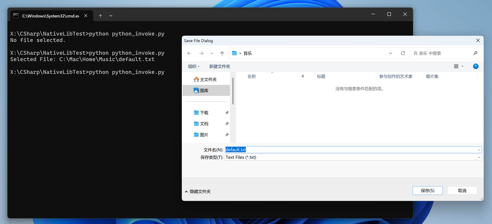

# DotnetNativeLibExportTest
.NET NativeAOT with [[UnmanagedCallersOnly]](https://learn.microsoft.com/en-us/dotnet/api/system.runtime.interopservices.unmanagedcallersonlyattribute?view=net-9.0) and Win32 IFileSaveDialog.

## Build
```
dotnet publish SaveDialogLib -r win-x64 -c Release -o artifact-x64
dotnet publish SaveDialogLib -r win-arm64 -c Release -o artifact-arm64
```

It’ll generate a `SaveDialogLib.dll` file that’s about 800+ KB.

## Screen


## Win32
Use [Microsoft.Windows.CsWin32](https://github.com/microsoft/CsWin32) to generate P/Invoke methods.

## Reference
[FileSavePicker](https://learn.microsoft.com/en-us/uwp/api/windows.storage.pickers.filesavepicker?view=winrt-26100)